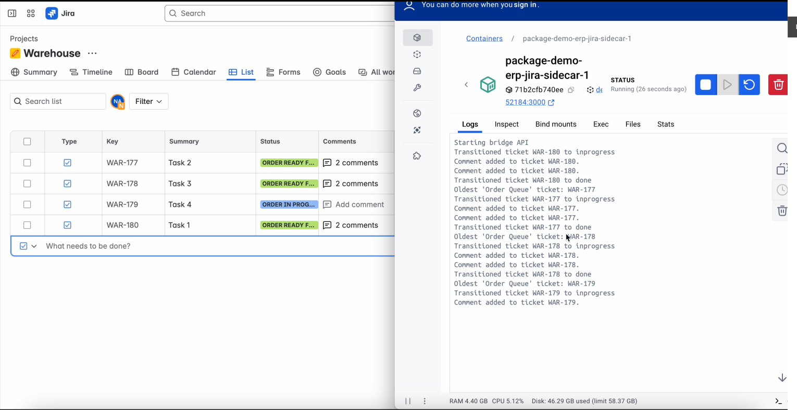

# Paranet + Jira Integration Project

This project demonstrates how paranet can interact with an ERP system — in this case, Jira — to automate task management workflows using actors and paraflows.

---

## Prerequisites

Ensure you have Paranet CLI installed by following the instructions at [https://docs.paranet.otonoma.com/download-install/](https://docs.paranet.otonoma.com/download-install/).

Additionally, configure the following environment variables in the `jira.py` actor:

- `JIRA_BASE_URL`
- `JIRA_API_EMAIL`
- `JIRA_API_TOKEN`
- `JIRA_PROJECT_KEY`

These variables are required to interact with the Jira API. You can generate an API token at:

- `{JIRA_BASE_URL}/manage-profile/security/api-tokens`

---

## Webhook Configuration

1. Navigate to `{JIRA_BASE_URL}/plugins/servlet/webhooks`.
2. Configure the webhook to point to the `processPayloadWebhook` method located in the `erp` actor at `erp.paraflow`.

---

## Project Organization

This project is organized into the following actors:

- **Workflow**: runs a simple workflow that interacts with various services (`server` and `erp`)
- **ERP Workflow (`erp.paraflow`)**: the main orchestrator that connects the ERP logic with the `jira` actor
- **Jira (`jira.py`)**: responsible for interacting with the Jira API
- **Mock Server (`server.py`)**: a test server that simulates API calls or external actor behavior (e.g., Isaac Sim actor or third-party APIs)

````yaml
- name: Workflow
  version: 0.0.1
  paraflow: workflow.paraflow
  path: ./actors/workflow

- name: ERP Workflow
  version: 0.0.1
  paraflow: erp.paraflow
  path: ./actors/erp
  sql:
    - erp.sql

- name: Jira
  version: 0.0.1
  path: ./actors/jira
  python_sdk: jira.py

- name: Mock server
  version: 0.0.1
  path: ./actors/mock-server
  python_sdk: server.py

---

## Local Execution

### Starting the Actors

1. Navigate to the root directory of the project.
2. Run the following command to deploy the node:
   ```bash
   para docker deploy node
````

3. Once the node is ready, deploy the package:
   ```bash
   para docker deploy package
   ```

---

## Testing

Once you have configured the API tokens and webhook, you can test the integration by following these steps:

There are two main testing flows:

### 1. Basic Workflow

1. Go to your Jira board and create a new task.
2. Observe the automated interaction between the Workflow, ERP, and Jira actors.

### 2. Order Queue Workflow

1. Before deploying the actors, create multiple Jira tasks with the status "Order Queue".
2. Then, deploy the actors and create one additional task to initiate the workflow.
3. The system will automatically handle the new task and, once it's marked as complete, it will fetch the oldest task in the "Order Queue" and continue the workflow from there.

This allows testing of sequential task execution based on creation time and demonstrates how Paranet handles task queues in an ERP-style system.

## Observing the Flow

Once your Paranet node and package are deployed, you can observe how the flow behaves using either of the following options:

### Option 1: Observe via Docker Logs (Recommended)

To understand how tasks move through the flow and how actors respond, you can monitor the logs of the `erp`, `jira`, and `workflow` containers.

There are several ways to access these logs:

- Using **Docker Desktop**, by selecting each container and viewing its logs.
- Using the **Docker extension for VS Code**, which provides a convenient UI to inspect logs for each service.
- Using your **terminal**, with your preferred method or script to follow container logs.

This is the best way to get detailed, real-time feedback on the internal behavior of your flow.

### Option 2: Observe via JIRA

If your flow includes the JIRA actor, you can observe its effects directly in your connected JIRA project:

- Tasks created, updated, or transitioned by the flow will appear in your JIRA board.
- This is useful for validating that the flow is correctly interacting with external services like JIRA.

Make sure your credentials and project settings in the flow configuration are correct to see the expected results in JIRA.


