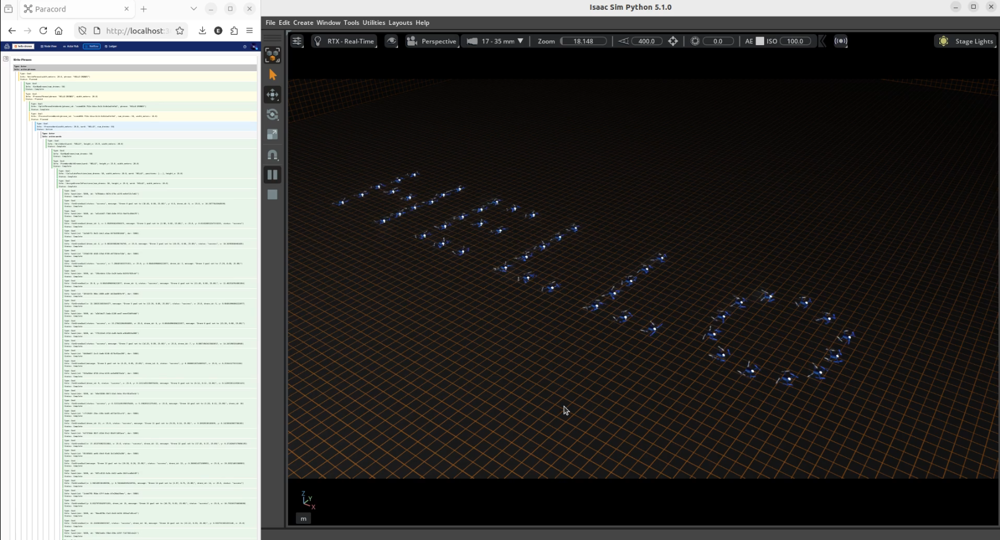

# Hello Drones

This demo showcases **actor composition** in Paranet using a drone swarm in NVIDIA Isaac Sim. Simple actors combine to create complex behaviors, demonstrating how `write_phrases` orchestrates both `write_words` and `random_movements` actors.

## Demo

[](hello-drones.mp4)

## Actor Composition

The kit demonstrates layered actor architecture:

**Base Actor** `actors.py` - Isaac Sim drone control  
**Movement Actor** `random_movements.paraflow` - Individual/formation random waypoints  
**Word Formation** `write_words.paraflow` - Clustering to form text  
**Phrase Writer** `write_phrases.paraflow` - Composes word formation + random movement

## Prerequisites

### Isaac Sim (Compatible with 4.2+):
- Complete `hello world` and `hello robot` paranet tutorials
- Verify [Isaac Sim Python Environment](__https://docs.isaacsim.omniverse.nvidia.com/latest/python_scripting/manual_standalone_python.html#details-how-python-sh-works__) works.

### Otonoma:
- [Download and Install](__https://docs.paranet.otonoma.com/download-install__)
- Verify `para -V` works
- Install Paranet SDK:

**Linux:**
  ```sh
cd ~/.local/share/ov/pkg/<YOUR-ISAAC-VERSION>/
./python.sh -m pip install paranet_agent
  ```

**Windows:**
  ```sh
cd C:\Users\<YourUser>\.local\share\ov\pkg\<YOUR-ISAAC-VERSION>\
python.bat -m pip install paranet_agent
  ```

**Version Requirements:** Python SDK v2.0.2+, Para CLI v0.27.0+

## Running the Demo

Initialize and deploy:
```sh
para init --template hello-drones
cd hello-drones
para docker deploy node
para docker deploy package
```

Start Isaac Sim:
- **Linux:** `~/.local/share/ov/pkg/<YOUR-ISAAC-SIM-VERSION>/python.sh isaac_app.py`
- **Windows:** `C:\Users\<YourUser>\.local\share\ov\pkg\<YOUR-ISAAC-SIM-VERSION>\python.bat isaac_app.py`

Test in Paracord ([http://localhost:3023](__http://localhost:3023__)):

1. **Base Movement:**
   - `drone_swarm/start_swarm_random_individual`
   - `drone_swarm/start_swarm_random_formation`
   - `drone_swarm/stop_swarm_routines`

2. **Word Formation:**
   - `drone_swarm/write_word` (word: "HELLO", width: 20, height: 15)

3. **Phrase Composition:**
   - `phrase_writer/write_phrase` (phrase: "HELLO WORLD", width: 20)
   - Observe: form word → random movement → stop → next word

## Common Issues

**Collisions:** There is no collision avoidance in this demo, if seeing many collisions, increase word width to reduce them.

**Performance:** Reduce `NUM_DRONES` in `isaac_app.py` if needed.