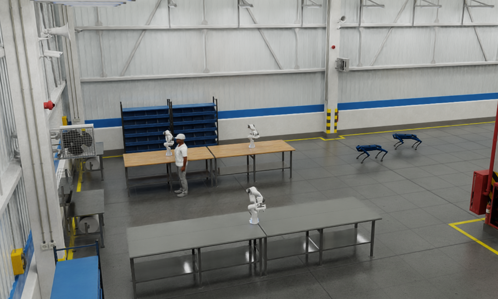

**Small Warehouse** is a robotics simulation project built on [NVIDIA Isaac Sim 4.5.0](https://docs.isaacsim.omniverse.nvidia.com/4.5.0/installation/download.html). It simulates a warehouse environment where a team of robots with **Spot quadrupeds** and **Franka robotic arms** cohabit. There is also a **sim_worker** which can be used to simulate the interaction with humans. Those actors can collaborate to create orchestrated logic and custom behavior layers using paraflow and the Paranet.



## Prerequisites:

### Isaac-sim 4.5 or 5.0:
- Complete and understand Nvidia's hello world and hello robot tutorials.
- Make sure you can execute [Nvidia's Isaac Sim's Python Environment](https://docs.isaacsim.omniverse.nvidia.com/latest/python_scripting/manual_standalone_python.html#details-how-python-sh-works)

### Otonoma:
- Complete the getting started tasks:
  - [Download and install Guide](https://docs.paranet.otonoma.com/download-install)
  - Ensure you can run `para -V` and get a version displayed.
- Install the Python Paranet SDK for Isaac-sim:
  
  #### Installation Command (for Isaac Sim 4.5):
  - **Linux:**
    ```sh
    cd ~/.local/share/ov/pkg/isaac-sim-4.5.0/
    ./python.sh -m pip install paranet_agent
    ```
  - **Windows:**
    ```sh
    cd C:\Users\<YourUser>\.local\share\ov\pkg\isaac-sim-4.5.0\
    python.bat -m pip install paranet_agent
    ```

> **Note:** Make sure to use the path to your Isaac Sim Python Environment.

### Version Requirements:
- Python SDK: v2.0.2 or higher
- Para: v0.21.0 or higher

## Setup:

Create and new folder and initialize with `para init --template small-warehouse`.

1. Navigate to the root of the init'ed `small-warehouse/simulation` directory.
   - **Result should look like:**
     ```
      simulation/
      ├── app.py # Entry point for the simulation
      ├── config/
      │ └── sim_config.yml # Scene and actor configuration for standard mode
      │ └── headless.yml # Scene and actor configuration for headless mode
      │ └── low_res.yml # Scene and actor configuration for low resolution mode
      ├── warehouse/
      │ ├── warehouse.py # Main simulation world logic
      │ ├── franka_isaac.py # Franka state machine & behavior
      │ ├── franka_actor.py # Franka actor interface (Paranet)
      │ ├── spot_isaac.py # Spot robot controller logic
      │ ├── spot_actor.py # Spot actor interface (Paranet)
      │ ├── sim_worker_isaac.py # Sim Worker logic
      │ ├── sim_worker_actor.py # Sim Worker interface (Paranet)
      │ ├── math_util.py # Math functions helper
      │ └── vfh.py # Navigation using Vector Field Histogram functions helper
     ```

## Running the Demo:

1. Open a terminal at `small-warehouse` root
2. Run the following commands to build the Paranet Docker project:
   ```sh
   para docker deploy node
   para docker deploy package
   ```
3. Observe the output to ensure the core Paranet services are online. This can also be monitored in the Docker extension.
4. Open the provided Paracord link from the terminal:
   - [http://localhost:3023](http://localhost:3023)
   - This is where we will later trigger skills.
5. Open a terminal at the Isaac-sim installation directory and use Isaac Sim's Python Environment to execute `app.py`:
   - **Linux:**
     ```sh
     ~/.local/share/ov/pkg/isaac-sim-4.5.0/python.sh app.py
     ```
   - **Windows:**
     ```sh
     C:\Users\<YourUser>\.local\share\ov\pkg\isaac-sim-4.5.0\python.bat app.py 
     ```

> **Note:** You can set the config file you want to run the app with by adding it at the end of the file:

```sh
~/.local/share/ov/pkg/isaac-sim-4.5.0/python.sh app.py --config low_res.yml
```

>   The default will be : `sim_config.yml`, `low_res.yml` is recommended for less powerful computers. 

6. In Paracord, navigate to the "Actor Hub" tab and find all the available actors
7. Test actor skills, such as:
   - `franka_1 -> disable`
   - `spot_2 -> goto`
   - `sim_worker_manager -> Work in Bench`

> **Note:** `para docker deploy package` initialize the package defined on `paranet.yaml` but other packages that uses the python SDK are also initialized when Isaac Sim is launched.

### Next Steps

Using the implemented skills, one can implement some autonomous behaviors like having the `spots` patrol the warehouse and monitor the `Franka robots`. That can alert the `Sim Worker` to repair a `Franka` when it is disabled.

Another possibility is to create collaborative logistics workflows where `Spots` use navigation skills to transport materials between workstations, while `Franka` robots handle precision assembly tasks. The `Sim Worker` can coordinate the workflow by monitoring status and directing robots to optimal positions based on distance calculations and current workload distribution.

## Configurable Setup

Inside `config/<config_file>.yml`, you will see something like this:
```
headless: false
low_res: true
sim_actors:
robot_arm:
    - name: franka1
    position: [0.0, 0.0, 0.0]
robot_quadruped:
    - name: spot1
    position: [0.0, 0.0, 0.0]
    color: blue
```
You can add more Frankas or Spots, define target positions, and customize names.

## Common Issues:

### Docker Network Error:
If you run `para docker deploy node` and get the following error:

```
failed to create network hello-robot-network: Error response from daemon: invalid pool request: Pool overlaps with other one on this address space
Failed to start paranet.
```

Run the following command to remove unused Docker objects:

```sh
docker system prune
```

## Demo

https://github.com/user-attachments/assets/152bb964-eaf6-4feb-a27c-4661b69ba931
