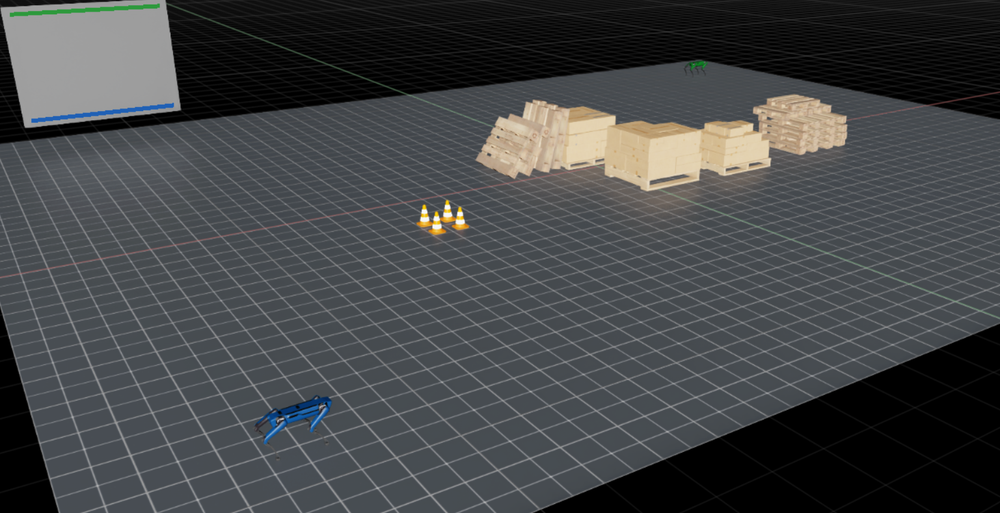
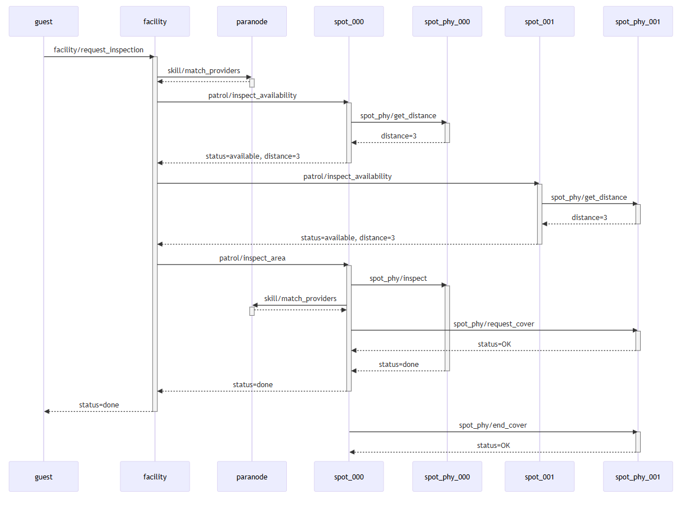

# Autonomous Spot Demo

This demo features two Boston Dynamics Spot robots patrolling and area as seen here.



When a user requests an area be inspected, a `facility` actor queries the active Spot actors for availability and selects one to do the inspection. The selected Spot queries the other Spot actors and directly asks one to cover for them while they perform the inspection.

This sequence diagram shows the message flow between all the actors for a single inspection request episode.



## Running the demo

The only requirements are an Isaac Sim 4.5 or 5.0 installation and the `para` CLI.

Start the Paranet environment with the `para docker deploy node` and `para docker deploy package` commands in the root folder.

Start the simulation with the `<isaac-python.sh-path> isaac_app.py` command in the root folder.

In Paracord, you will see many actors, but should only interact with the "Facility" actor. Use the Request Inspection skill to direct the closet Spot to inspect a specific location. Locations are specified by a row and col perimeter grid location. Valid locations are:

- **Top** row=3, col in range [0,4]
- **Bottom** row=0, col in range [0,4]
- **Left** col=0, row in range [0,3]
- **Right** col=4, row in range [0,3]

## Architecture

The Spot robots are autonomous in that they make decisions about tasks changes and communicate directly with each other without requiring a central orchestrator. The following architecture depicts the autonomy stack that operates the robot. Note that the Spot has a computational payload mounted on the robot which is where the autonomy stack runs.


The example code corresponds to the diagram as follows:

**Fleet management** `actors/facility.paraflow`

**Robot Actor** `actors/spot.paraflow`

**Robot Phy Actor** `actors/spot_phy.py`

**Algorithms** `libs/map.py`, `libs/vfh.py`

**Spot API Client** not implemented

**Robot Simulation** `simulation/spot_sim.py`

## Project

The source code is organized as follows:

```
models/       # Paranet models (common to simulation and production)
actors/       # Paraflow and Python actors (common to simulation and production)
libs/         # Algorithm and utility Python modules (common to simulation and production)
simulation/   # Simulation-only Python modules
isaac_app.py  # Simulation entry point
```

## Useful Patterns

### Ask-Request pattern

The `facility.paraflow` and `spot.paraflow` both make use of the ask-request pattern. This is a common autonomy pattern for allocating tasks. The pattern involves performs these steps when a new task needs to be done:

1. Discover candidate actors (i.e. actors that are on-line and has the desired skill).
2. Ask the candidates for their availability and/or cost for performing the task.
3. Select the best one however that is defined for the application.
4. Send the request directly to the chosen actor.

### Actor/Phy Actor pattern

An autonomous robot will typically have some level of workflow and Paranet collaboration as well algorithmic code and communication to the underlying hardware API. The former is better suited for Paraflow while the later for Python. This pattern uses a Paraflow actor `<name>.paraflow` for workflow and collaboration and wraps the lower-level Python code in a Python actor `<name>_phy.py`. Normally, the Python actor is private and only called by Paraflow actor.

### Phy Actor/Client pattern

The skills offered by the robot hardware are accessed by some API library. In order to reuse the phy actor between simulation and production deployment, the phy actor will access the robot functionality indirectly through a client module which has two implementations, one for simulation and one for real hardware.
